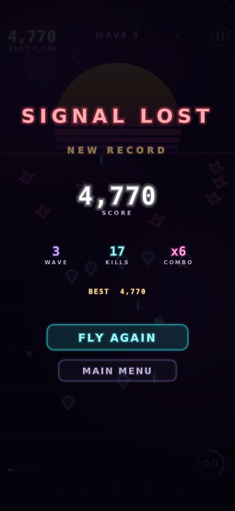

# Neon Void

A synthwave arcade shoot-'em-up for Android. One thumb, no menus to wade through,
no dependencies — pure Kotlin drawing onto a `SurfaceView`.

<p align="center">
  
  
  
  
</p>

> The images above are rendered from the game's own drawing code through a headless
> harness (see [Verification](#verification)), not captured from a device.

## How to play

| Action | Control |
| --- | --- |
| Fly | Drag anywhere on the screen — the ship follows your finger's movement, not its position, so your thumb never covers the ship |
| Shoot | Automatic |
| Overdrive | Tap the **OD** dial (bottom right), or tap anywhere with a second finger |
| Pause | Button at the top right, or the back gesture |

**Your hitbox is tiny.** The ship is 15 units across but only the 5-unit core can be
hit, so bullets that look like they clip you usually don't.

**Graze to win.** Letting an enemy bullet pass within 26 units of your core charges
the Overdrive meter and pays 15 points. Playing safe at the bottom of the screen
charges nothing — the meter rewards flying into the mess and slipping out.

**Overdrive** (4.5s) wipes every bullet on screen for score, doubles your damage,
nearly doubles your fire rate, adds angled side cannons and makes you invulnerable.
Ramming enemies during it destroys them.

**Combo** multiplier climbs 0.1× per kill (up to 9.9×) and decays 3.2 seconds after
your last kill. It resets when you're hit — the multiplier, not the raw score, is
where big runs are made.

### Enemies

| | Behaviour |
| --- | --- |
| **Drifter** | Descends steadily, fires aimed single shots |
| **Weaver** | Sine-weaves down the screen, fires aimed pairs |
| **Charger** | Drops in, locks on (red telegraph ring), then dives at you. Doesn't shoot — dodge it |
| **Turret** | Hovers and pumps out 8-way radial bursts. Tanky. Withdraws after 16 seconds |
| **Guardian** | Boss, every 5th wave. Three phases — aimed fans, then radial rings, then a relentless spiral with heavy shells |

Weapons upgrade to level 5 via `W` pickups; `S` grants a shield that absorbs one hit,
`+` is an extra life. A pity timer guarantees a weapon drop if you've gone 14 kills
without one, so a cold-streak run still ramps up.

## Building

Requires JDK 17+ and the Android SDK (compileSdk 35).

```bash
./gradlew assembleDebug          # APK at app/build/outputs/apk/debug/
./gradlew installDebug           # to a connected device or emulator
```

Or open the project folder in Android Studio and press Run.

minSdk is 24 (Android 7.0). The app requests only `VIBRATE`, has no network code,
no analytics and no third-party libraries.

## Code layout

```
app/src/main/java/com/neonvoid/game/
  MainActivity.kt   Fullscreen host activity
  GameView.kt       SurfaceView + render thread, touch capture, insets
  Game.kt           State machine (menu/playing/paused/over), input routing,
                    virtual 540-unit coordinate system
  World.kt          Simulation: player, bullets, enemies, pickups, wave
                    director, boss patterns, scoring
  Entities.kt       Entity structs, ship silhouettes, entity rendering
  Background.kt     Synthwave backdrop: banded sun, perspective grid,
                    parallax stars, drifting nebulae
  Hud.kt            In-run HUD, title/pause/game-over screens
  Fx.kt             Particles, shockwaves, floating text, screen shake,
                    hit-stop, full-screen flashes
  Neon.kt           Palette, math helpers, stacked-stroke neon drawing
  Prefs.kt          Local best score / wave / combo
  Haptics.kt        Vibration wrapper
```

Everything is drawn procedurally — the only bundled assets are the launcher icons.
Gameplay is authored in a 540-unit-wide virtual space and scaled to the device, so
layout and difficulty are identical on every screen size.

### Tuning

Most of the feel lives in a handful of constants:

- `World.GRAZE_R`, `OD_DURATION`, `COMBO_WINDOW` — the risk/reward loop
- `World.spawnEnemy` — per-enemy HP, speed and fire rates, plus the per-wave scaling
- `World.buildWave` — wave composition and group pacing
- `World.dropLoot` — drop tables and the weapon pity timer
- `Fx` — particle counts, shake trauma, hit-stop durations

## Verification

The Android SDK could not be downloaded in the environment this was written in, so
the APK has **not** been compiled or run on a device. Instead the code was validated
headlessly:

- Type-checked against hand-written Android API stubs (`compileKotlin`, clean).
- Played out headlessly: an 8-minute automated run reaching wave 19 confirms wave
  progression, boss spawns and phases, scoring, weapon ramp and that no wave can
  stall; runs without invulnerability confirm the damage and game-over paths.
- Driven through every UI transition with synthetic touches: menu → play → pause →
  resume → app-pause → back → death → retry.
- Rendered to PNG by backing the Canvas stubs with Java2D, which produced the
  screenshots above.

Expect to tune numbers once it's in your hands on a real device — that's where the
last 10% of feel gets decided.
