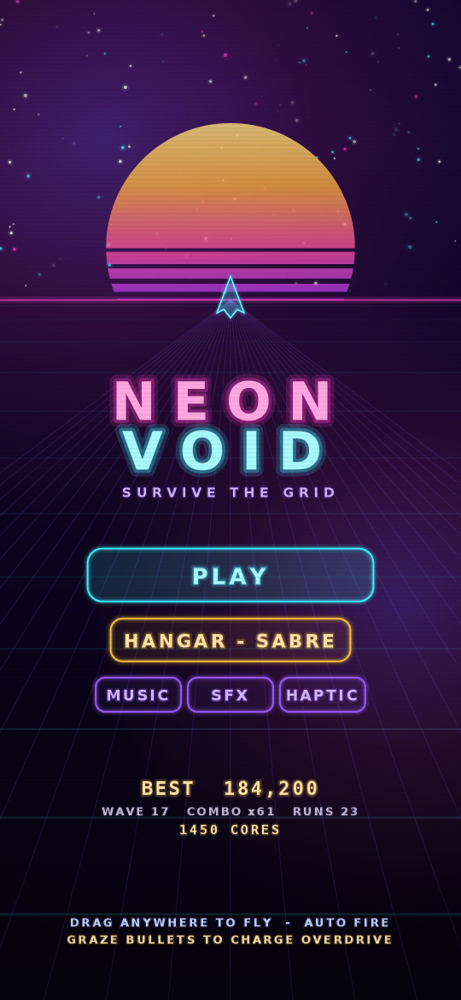
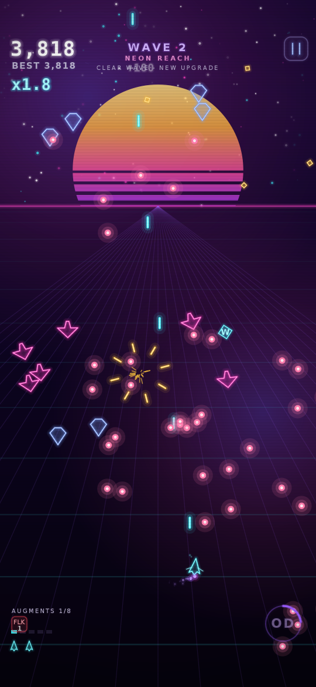
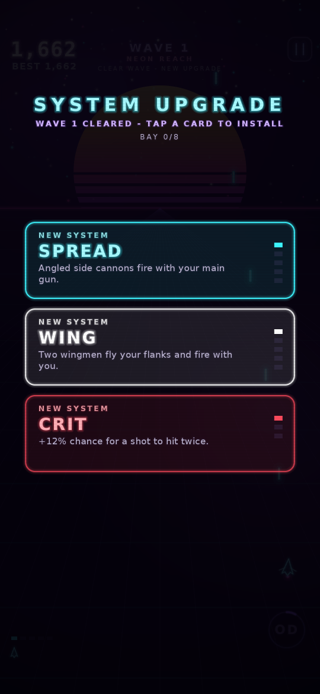
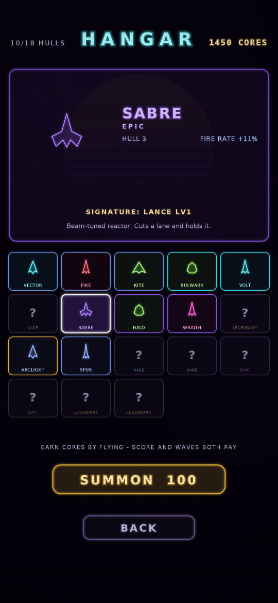
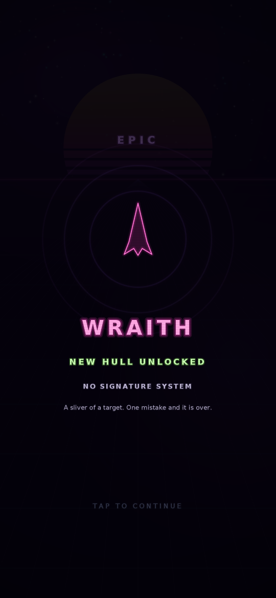
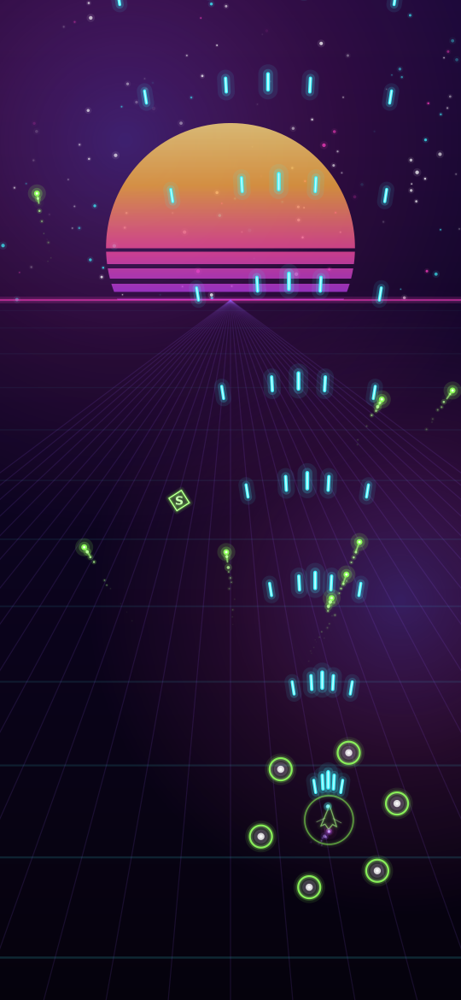
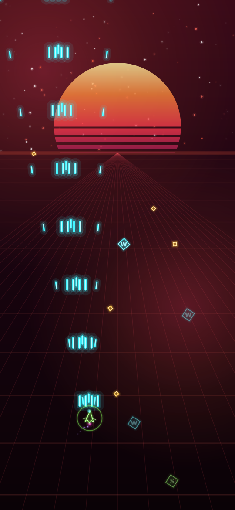
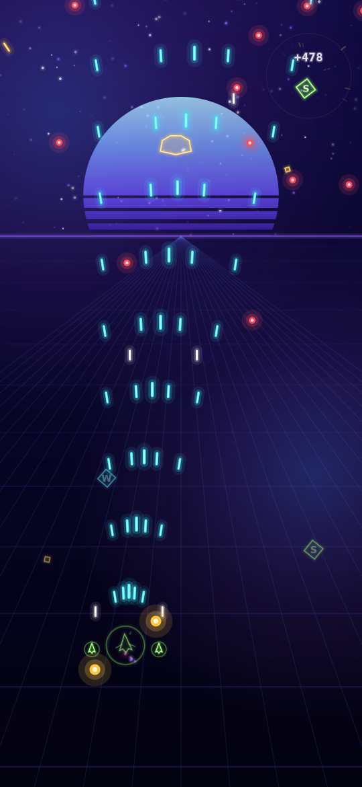
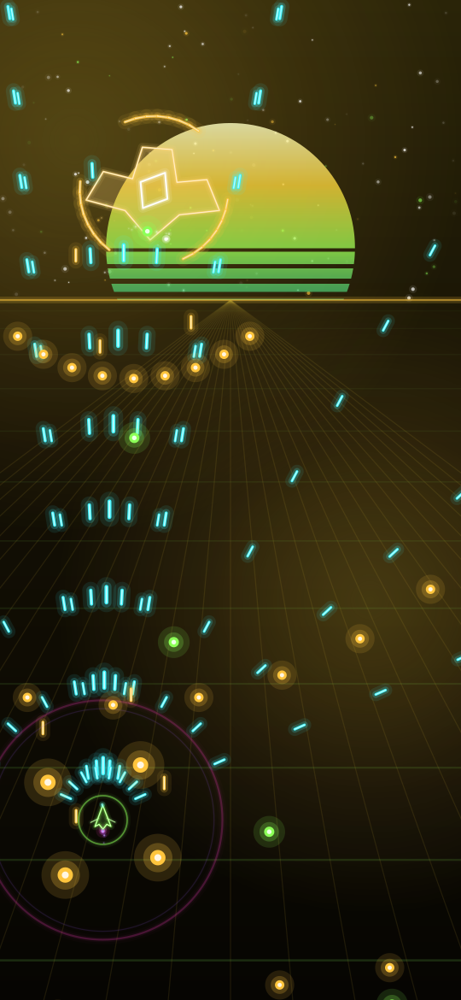

# Neon Void

A synthwave arcade shoot-'em-up for Android. One thumb, no menus to wade through,
no dependencies — pure Kotlin drawing onto a `SurfaceView`.

<p align="center">
  
  
  
</p>
<p align="center">
  
  
  
</p>
<p align="center">
  
  
  
</p>

> The images above are rendered from the game's own drawing code through a headless
> harness (see [Verification](#verification)), not captured from a device.

## Download

Every push builds the APK on GitHub Actions and attaches it to the rolling
**[`neon-void-latest`](../../releases/tag/neon-void-latest)** pre-release.

- **`neon-void.apk`** - install this one.
- **`neon-void-debug.apk`** - debug build, useful if you want logcat output.

To sideload: download on the phone, allow installs from your browser or file
manager when prompted, then open the APK. Each CI run signs with a freshly
generated key, so uninstall an older copy before installing a newer one.

The same APKs are also on the run's summary page under **Actions -> Build APK ->
Artifacts**.

## How to play

| Action | Control |
| --- | --- |
| Fly | Drag anywhere on the screen — the ship follows your finger's movement, not its position, so your thumb never covers the ship |
| Shoot | Automatic |
| Overdrive | Tap the **OD** dial (bottom right), or tap anywhere with a second finger |
| Pause | Button at the top right, or the back gesture |

**Your hitbox is tiny.** The ship is 15 units across but only the 5-unit core can be
hit, so bullets that look like they clip you usually don't.

**Graze to win.** Letting an enemy bullet pass within 26 units of your core charges
the Overdrive meter and pays 15 points. Playing safe at the bottom of the screen
charges nothing — the meter rewards flying into the mess and slipping out.

**Overdrive** (4.5s) wipes every bullet on screen for score, doubles your damage,
nearly doubles your fire rate, adds angled side cannons and makes you invulnerable.
Ramming enemies during it destroys them.

**Combo** multiplier climbs 0.1× per kill (up to 9.9×) and decays 3.2 seconds after
your last kill. It resets when you're hit — the multiplier, not the raw score, is
where big runs are made.

### Sectors

The run moves through five themed sectors, five waves each, then loops at a
higher difficulty tier. Each sector has its own palette, enemy roster, music
track and boss. Difficulty is linear through the opening and quadratic later —
the first waves stay readable while a fully-augmented ship still meets bosses
that can kill it. From wave 10 every boss also calls in escorts.

| Sector | Enemies | Boss |
| --- | --- | --- |
| **NEON REACH** | Drifters, weavers, chargers | **GUARDIAN** — fans, rings, spiral barrage |
| **CRIMSON BELT** | Chargers, swarmers, lancers, wisps | **WARDEN** — dashes the arena, calls in wings |
| **VIOLET DEPTHS** | Turrets, orbiters, minelayers, pylons | **HIVE** — spawns broods, pulses rings |
| **GOLD CIRCUIT** | Splitters, shielders, carriers, lancers | **FORGE** — armour plates block two thirds of its arc |
| **VOID CORE** | Everything, plus elites | **NULLIFIER** — blinks and answers with mirrored spirals |

Fifteen enemy types in all. Beyond the basics: **LANCER** holds a lane and
telegraphs a column of fire, **ORBITER** circles a point firing along its
tangent, **SPLITTER** breaks into faster halves, **MINELAYER** seeds proximity
mines, **SWARMER** dives in packs, **SHIELDER** holds a plate towards you so
shots have to come from the flank, **WISP** blinks after every burst,
**CARRIER** keeps making swarmers until you deal with it, and **PYLON** drops in
pairs that string a lethal line between them — kill either end to cut it.

Elites start appearing from wave 7 — same silhouette, white halo, far more
health, much better drops.

### Augments

Clear a wave and the run pauses for a **system upgrade**: three cards, pick one.
There are two kinds.

**Abilities** are whole new weapon systems. You can carry at most **three**, and
the augment bay holds **eight augments in total** — once it is full the only
offers are level-ups of what you already carry. Early picks are commitments.

| | What it does |
| --- | --- |
| **SPREAD** | Angled side cannons that fire with your main gun |
| **LANCE** | A piercing beam that sweeps the lane ahead of you |
| **SWARM** | Homing missiles that hunt the nearest target |
| **ORBIT** | Nodes that circle your hull and shred what they touch |
| **ARC** | Lightning that leaps from target to target |
| **PULSE** | A shockwave that detonates outward on a timer |
| **FLAK** | Lobbed shells that burst into shrapnel mid-flight |
| **TETHER** | A cutting beam that latches onto the nearest target |
| **WING** | Two wingmen fly your flanks and fire with you |

The HUD shows `AUGMENTS n/8` above the lives, and the choice screen shows the
bay state, so you always know how much room is left.

**Split choices.** Level an ability to 3 and it must **evolve** — and the next
offer puts *both* branches on the table together, so the fork is always an
explicit choice, never a card you might never be shown. Evolved abilities keep
levelling to 5 down the path you chose.

| Ability | Branch A | Branch B |
| --- | --- | --- |
| SPREAD | **FAN** — eight-shot arc, faster cadence | **PHALANX** — four heavy bolts that pierce ranks |
| LANCE | **PRISM** — three beams fanning outward | **SIEGE** — one colossal beam, ruinous damage |
| SWARM | **HORNETS** — a fast swarm of light seekers | **WARHEAD** — one heavy missile with a blast radius |
| ORBIT | **AEGIS** — bigger nodes that also eat enemy fire | **SENTRY** — nodes gain their own forward guns |
| ARC | **TEMPEST** — storms across seven targets | **RAILGUN** — one devastating bolt down a line |
| PULSE | **NOVA** — huge blast that banks enemy fire as score | **REPULSOR** — a constant field that repels bullets |
| FLAK | **CLUSTER** — three shells per volley | **AIRBURST** — one shell, enormous burst |
| TETHER | **LEECH** — the beam feeds your overdrive | **SIPHON** — cuts harder and drags the target in |
| WING | **ESCORT** — wingmen soak incoming fire | **STRIKE** — wingmen carry missiles |

**Stat modules** are the other half of the offer, repeatable and stackable:
RAPID (fire rate), POWER (damage), VELOCITY (projectile speed), AGILITY
(handling), MAGNET (pickup radius), GRAZE (overdrive charge), ARMOR (shield
capacity), SALVAGE (score), REPAIR (hull), COOLANT (ability cooldowns), PIERCE
(shots punch through one more enemy), CRIT (chance to hit twice) and RECLAIM
(pickups top up overdrive).

Twenty-two augments in total, nine of them abilities, for eight bay slots.

Your current kit shows as badges above the lives counter, and in full on the
pause screen.

### Hangar

Runs pay out **cores** — from score and from waves cleared. Spend them in the
hangar to summon new hulls. There are eleven, across four rarities, and each
one changes how a run plays: its own silhouette, its own stat profile, and most
of them a **signature augment** installed free at launch.

| | Hulls |
| --- | --- |
| **Common** | VECTOR (baseline), PIKE (heavy rounds, heavy stick), KITE (light and nimble), SPUR (racing frame) |
| **Rare** | BULWARK (four hull segments, a shield, slow guns), VOLT (SPREAD pre-fitted), LANTERN (double magnet, +15% score), EMBER (FLAK pre-fitted), GLASS (one hull segment, enormous guns) |
| **Epic** | SABRE (LANCE pre-fitted), HALO (ORBIT pre-fitted, starts shielded), WRAITH (tiny hitbox, +70% graze), VESPER (TETHER pre-fitted), TITAN (five hull segments, very slow trigger) |
| **Legendary** | NOVA-9 (PULSE Lv2, +25% score), ARCLIGHT (ARC Lv2, +2 damage), ORACLE (WING Lv2, +20% score), PHANTOM (3.4-unit hitbox, double graze) |

Eighteen hulls in all.

Duplicates refund cores, scaled by rarity.

### Sound

Music and effects are generated at runtime by a small software synth — a step
sequencer driving square, saw, triangle and noise voices through an envelope,
a sweeping one-pole filter and a soft clipper. Six tracks (menu plus one per
sector), each built from four alternating bars with an arpeggio layer, a
detuned lead, octave-jumping bass and a drum fill closing every fourth bar.
Boss waves switch the arrangement to a busier mix. No audio files ship with
the game. Music, effects and haptics each toggle from the title screen.

### Enemies

| | Behaviour |
| --- | --- |
| **Drifter** | Descends steadily, fires aimed single shots |
| **Weaver** | Sine-weaves down the screen, fires aimed pairs |
| **Charger** | Drops in, locks on (red telegraph ring), then dives at you. Doesn't shoot — dodge it |
| **Turret** | Hovers and pumps out 8-way radial bursts. Tanky. Withdraws after 16 seconds |
| **Guardian** | Boss, every 5th wave. Three phases — aimed fans, then radial rings, then a relentless spiral with heavy shells |

Weapons upgrade to level 5 via `W` pickups; `S` grants a shield that absorbs one hit,
`+` is an extra life. A pity timer guarantees a weapon drop if you've gone 14 kills
without one, so a cold-streak run still ramps up.

## Building

Requires JDK 17+ and the Android SDK (compileSdk 35).

```bash
./gradlew assembleDebug          # APK at app/build/outputs/apk/debug/
./gradlew installDebug           # to a connected device or emulator
```

Or open the project folder in Android Studio and press Run.

minSdk is 24 (Android 7.0). The app requests only `VIBRATE`, has no network code,
no analytics and no third-party libraries.

## Code layout

```
app/src/main/java/com/neonvoid/game/
  MainActivity.kt   Fullscreen host activity
  GameView.kt       SurfaceView + render thread, touch capture, insets
  Game.kt           State machine (menu/playing/paused/over), input routing,
                    virtual 540-unit coordinate system
  World.kt          Simulation: player, bullets, enemies, pickups, wave
                    director, boss patterns, scoring
  Augments.kt       Augment catalogue, evolution branches, offer generation
                    and every stat the loadout derives
  Sectors.kt        Themed sector table: palettes, rosters, bosses, music
  EnemyAI.kt        Per-kind enemy behaviour
  Bosses.kt         The five boss archetypes and their phases
  Ships.kt          Hull roster, rarities, gacha rolls, hull silhouettes
  Synth.kt          Procedural music and sound effects (no Android deps)
  Audio.kt          AudioTrack pump feeding the synth
  Arsenal.kt        Ability systems: beams, homing swarms, orbital nodes,
                    chain lightning and shockwave novas
  Entities.kt       Entity structs, ship silhouettes, entity rendering
  Background.kt     Synthwave backdrop: banded sun, perspective grid,
                    parallax stars, drifting nebulae
  Hud.kt            In-run HUD, title/pause/game-over screens
  Fx.kt             Particles, shockwaves, floating text, screen shake,
                    hit-stop, full-screen flashes
  Neon.kt           Palette, math helpers, stacked-stroke neon drawing
  Prefs.kt          Local best score / wave / combo
  Haptics.kt        Vibration wrapper
```

Everything is drawn procedurally — the only bundled assets are the launcher icons.
Gameplay is authored in a 540-unit-wide virtual space and scaled to the device, so
layout and difficulty are identical on every screen size.

### Tuning

Most of the feel lives in a handful of constants:

- `World.GRAZE_R`, `OD_DURATION`, `COMBO_WINDOW` — the risk/reward loop
- `Aug.MAX_SLOTS`, `MAX_ABILITIES`, `BASE_MAX`, `EVOLVED_MAX` — how specialised
  a run gets and how hard the choices bite
- `Sectors.list` — sector palettes, enemy rosters and boss assignment
- `ShipDex.list` / `Rarity.weights` — hull stats and pull rates
- `Loadout` derived getters — what each stat module is worth
- `Arsenal.tick*` — cadence and damage for every ability and branch
- `World.spawnEnemy` — per-enemy HP, speed and fire rates, plus the per-wave scaling
- `World.buildWave` — wave composition and group pacing
- `World.dropLoot` — drop tables and the weapon pity timer
- `Fx` — particle counts, shake trauma, hit-stop durations

## Verification

`dl.google.com` and Google's Maven host are blocked by the network policy of the
environment this was written in, so the APK is built by GitHub Actions rather than
locally, and the game has **not** been run on a physical device. The code was
validated headlessly here:

- Type-checked against hand-written Android API stubs (`compileKotlin`, clean).
- Played out headlessly: an 8-minute automated run reaching wave 20 confirms wave
  progression, boss spawns and phases, scoring, weapon ramp, augment offers and
  that no wave can stall; runs without invulnerability confirm the damage and
  game-over paths.
- Every ability path forced and played: all 27 combinations (nine abilities, base
  plus both evolutions) run 150 simulated seconds each without a crash, and land
  within a reasonable band of each other on wave reached and score.
- The soundtrack rendered offline to WAV and checked for level, clipping and
  rhythmic structure — the synth is deliberately free of Android imports so the
  audio that ships is the audio that was inspected.
- Driven through every UI transition with synthetic touches: menu → hangar →
  summon → reveal → hull select → play → augment choice → pause → resume →
  app-pause → back → death → retry.
- Rendered to PNG by backing the Canvas stubs with Java2D, which produced the
  screenshots above.

Expect to tune numbers once it's in your hands on a real device — that's where the
last 10% of feel gets decided.
