# Neon Void

A synthwave arcade shoot-'em-up for Android. One thumb, no menus to wade through,
no dependencies — pure Kotlin drawing onto a `SurfaceView`.

<p align="center">
  
  
  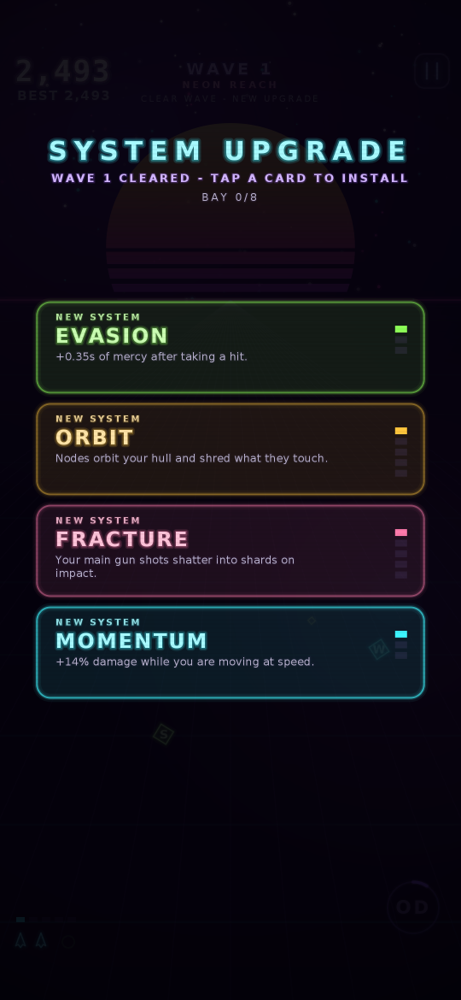
</p>
<p align="center">
  
  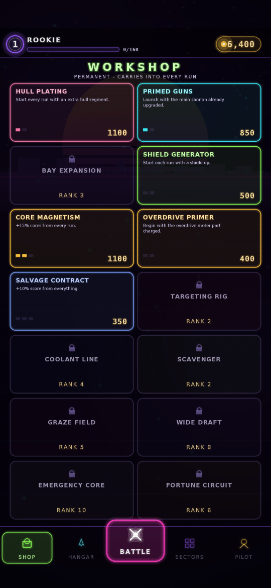
  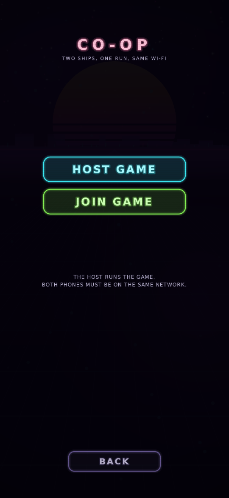
</p>
<p align="center">
  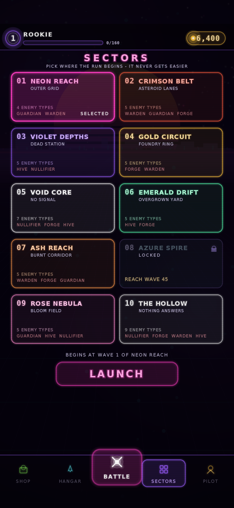
  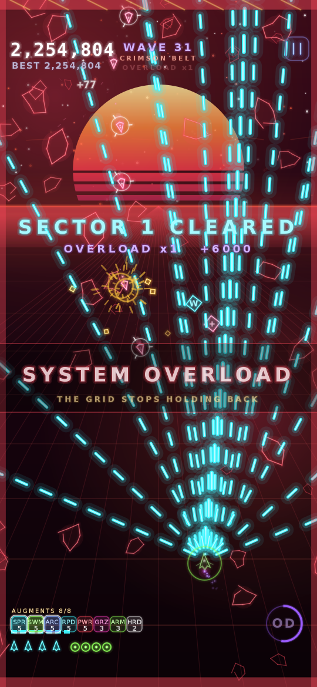
  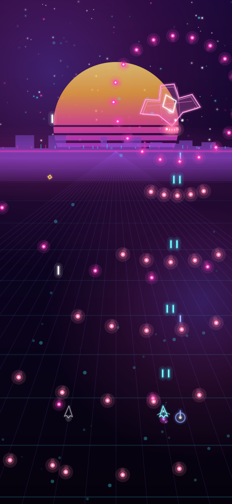
</p>
<p align="center">
  
  
  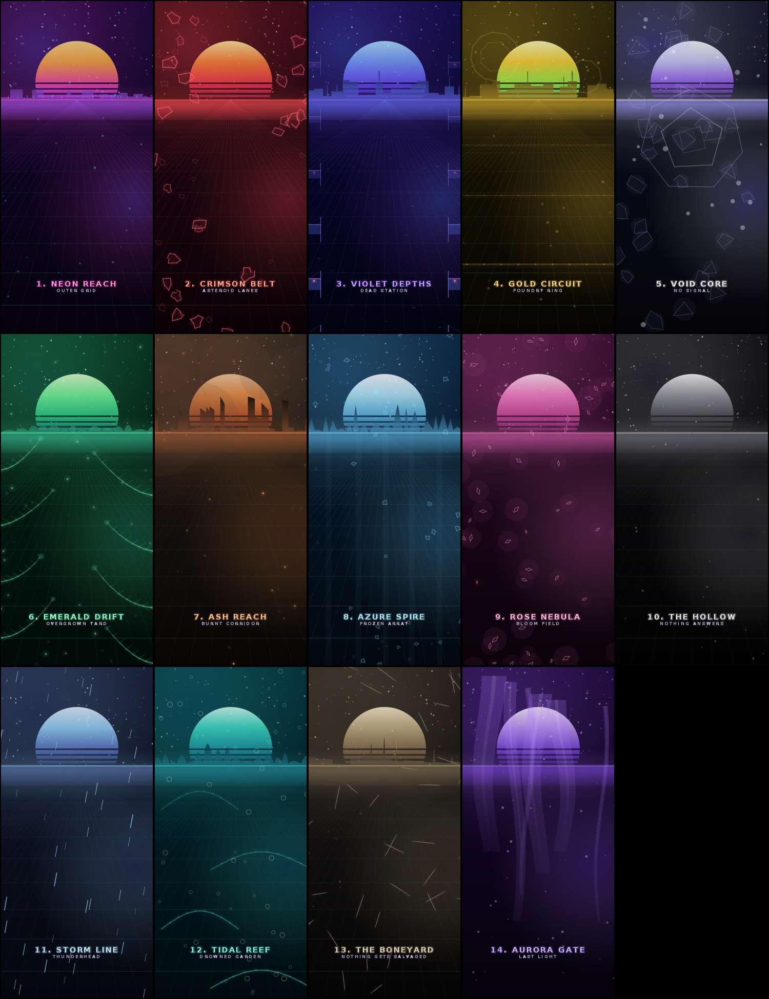
</p>
<p align="center">
  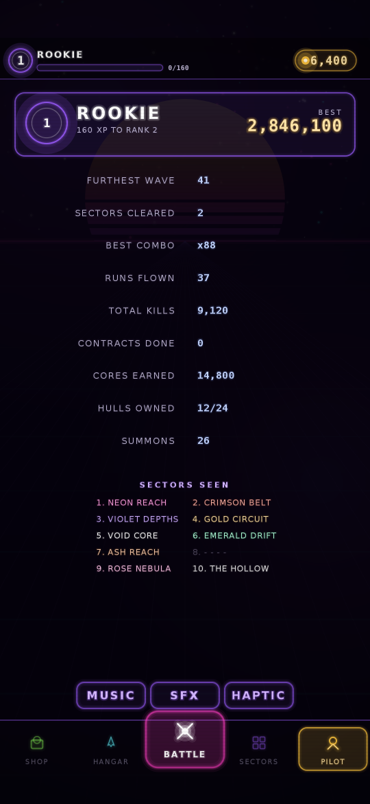
  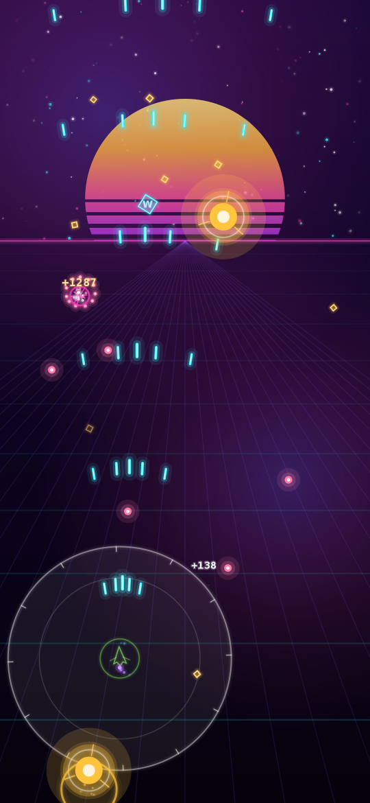
  
</p>

<p align="center">
  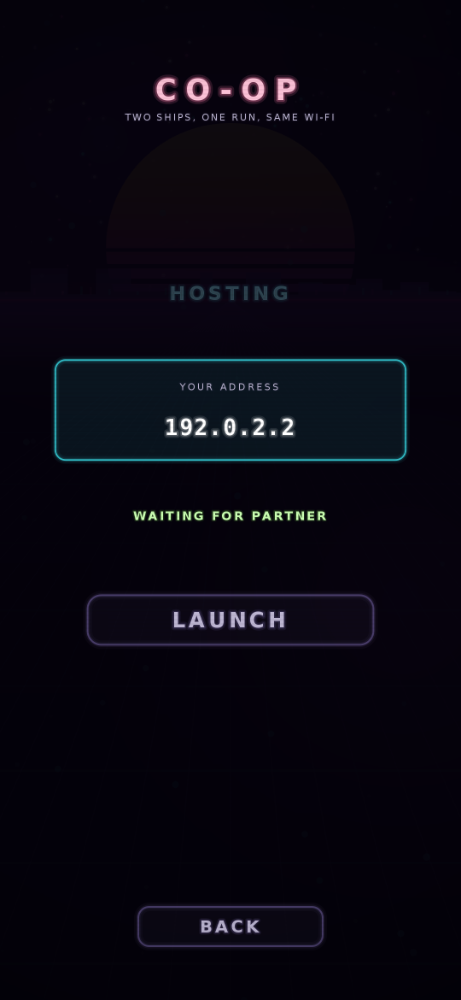
  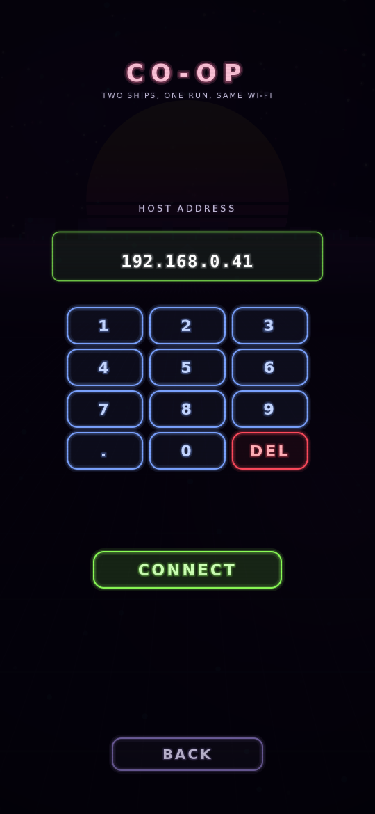
</p>

<p align="center"></p>

> The images above are rendered from the game's own drawing code through a headless
> harness (see [Verification](#verification)), not captured from a device.

## Download

Every push builds the APK on GitHub Actions and attaches it to the rolling
**[`neon-void-latest`](../../releases/tag/neon-void-latest)** pre-release.

- **`neon-void.apk`** - install this one.
- **`neon-void-debug.apk`** - debug build, useful if you want logcat output.

To sideload: download on the phone, allow installs from your browser or file
manager when prompted, then open the APK. Each CI run signs with a freshly
generated key, so uninstall an older copy before installing a newer one.

The same APKs are also on the run's summary page under **Actions -> Build APK ->
Artifacts**.

## How to play

| Action | Control |
| --- | --- |
| Fly | Drag anywhere on the screen — the ship follows your finger's movement, not its position, so your thumb never covers the ship |
| Shoot | Automatic |
| Overdrive | Tap the **OD** dial (bottom right), or tap anywhere with a second finger |
| Pause | Button at the top right, or the back gesture |

**Your hitbox is tiny.** The ship is 15 units across but only the 5-unit core can be
hit, so bullets that look like they clip you usually don't.

**Graze to win.** Letting an enemy bullet pass within 26 units of your core charges
the Overdrive meter and pays 15 points. Playing safe at the bottom of the screen
charges nothing — the meter rewards flying into the mess and slipping out.

**Overdrive** (4.5s) wipes every bullet on screen for score, doubles your damage,
nearly doubles your fire rate, adds angled side cannons and makes you invulnerable.
Ramming enemies during it destroys them.

**Combo** multiplier climbs 0.1× per kill (up to 9.9×) and decays 3.2 seconds after
your last kill. It resets when you're hit — the multiplier, not the raw score, is
where big runs are made.

### Levels

The run moves through fourteen themed levels of **30 waves** each, then loops.
Every level has its own palette, enemy roster, boss pool and music track. Bosses
land every fifth wave, so six per sector, and the sixth closes it out.

Sectors open in order. Each carries its own goal — reach a wave, pass a score,
bank a kill count, own enough hulls — and a sector needs both its own goal and
the one before it, so the map never opens with a hole in the middle.

### The overload

Clearing a sector is not a stopping point — it is the point where the grid stops
holding back. Wave 30 falls, a klaxon goes off, the screen frames itself in
hazard red and **everything that can be sped up is, permanently**: enemies fire
17% faster, their shots travel 17% faster, they move 14% faster, carry 18% more
health, arrive in far greater numbers and the breather between waves shortens.
Every sector after that stacks another tier on top.

It is a killscreen, not a wall. Against a scripted dodging pilot, crossing the
first overload roughly halves how far a run gets per pool of hull segments —
from about three waves to one or two — without ever making progress impossible.
Bullet speed is capped so a shot always crosses the screen slowly enough to be
read.

The pressure comes from **density and danger rather than hit points**. A deep
wave used to be spongy and nearly empty: measured against a fixed maxed build,
wave 63 held an average of 3.5 enemies on a screen that fits 56, and took nearly
two minutes to clear — the ship deleted each trickle and then waited. Groups now
compress onto the timeline the deeper the run goes, health scales far more
gently, and the speed, fire-rate and elite dials keep climbing instead of all
capping out around wave 35. The same wave now runs at 20–29 enemies on screen,
peaks at the cap, and clears in about 35 seconds.

**SECTORS**, on the main menu, is where levels open up. Every sector is listed
from the first run so you can see what is ahead, but only the first is unlocked;
the rest show what they are waiting for and open as you meet it. Pick an
unlocked sector and the run *starts* there — its backdrop, its roster, its
bosses and its music from wave 1 — and rolls on into the following sectors from
that point. Difficulty comes from the wave number and the overload tier, never
from which sector you picked, so starting at THE HOLLOW is no harder than
starting at NEON REACH — it changes what you are looking at and shooting, not
how hard it hits. The sector-select screen plays each sector's track while you
browse it.

| | Sector | Opens when |
| --- | --- | --- |
| 1 | NEON REACH | open from the start |
| 2 | CRIMSON BELT | reach wave 8 |
| 3 | VIOLET DEPTHS | reach wave 16 |
| 4 | GOLD CIRCUIT | reach wave 24 |
| 5 | VOID CORE | score 150,000 |
| 6 | EMERALD DRIFT | clear a level |
| 7 | ASH REACH | 1,500 total kills |
| 8 | AZURE SPIRE | reach wave 45 |
| 9 | ROSE NEBULA | own 8 hulls |
| 10 | THE HOLLOW | clear 2 levels |

Anything you unlock is announced on the game-over screen.

| | Level | Cast |
| --- | --- | --- |
| 1 | **NEON REACH** | Drifters, weavers, chargers |
| 2 | **CRIMSON BELT** | Chargers, swarmers, lancers, wisps |
| 3 | **VIOLET DEPTHS** | Turrets, orbiters, minelayers, pylons |
| 4 | **GOLD CIRCUIT** | Splitters, shielders, carriers, lancers |
| 5 | **VOID CORE** | Everything at once |
| 6 | **EMERALD DRIFT** | Splitters, carriers, swarmers, orbiters |
| 7 | **ASH REACH** | Lancers, shielders, minelayers, chargers |
| 8 | **AZURE SPIRE** | Wisps, pylons, orbiters, turrets |
| 9 | **ROSE NEBULA** | Weavers, swarmers, wisps, splitters |
| 10 | **THE HOLLOW** | The full roster, heavy on elites |

Each level draws its bosses from its own pool, so the seven boss fights inside a
level vary and the mix differs between levels.

Bosses arrive every fifth wave and they are a wall: a large flat base of health,
a steep climb per wave and a capped quadratic on top, so a wave-40 fight is a
genuine fight rather than a formality. They cycle their attack patterns faster
the deeper you are, and call escorts from wave 5 onward. A phase change no
longer wipes the bullets already in the air — the boss simply stops firing for
the transition, so the screen clears on its own and what you dodged stays
dodged. Past a minute in one fight the boss slowly starts giving, so a weak
build is never stuck against an unkillable wall.

### Sector terrain

Sectors are not recolours of one backdrop. Each has its own **terrain**: a
horizon silhouette built procedurally on resize, plus a parallax layer of
furniture drawn behind the play field.

| Sector | What you fly through |
| --- | --- |
| NEON REACH | A city skyline with windows blinking on and off |
| CRIMSON BELT | Tumbling asteroids at three depths, and a debris band across the sun |
| VIOLET DEPTHS | Girder frames sliding past on both edges with hazard lights |
| GOLD CIRCUIT | Gear wheels behind the sun, pipe bands and rivets running with the grid |
| VOID CORE | No grid at all: slow wireframe hulks and a field of dead pixels |
| EMERALD DRIFT | Fronds leaning in from the edges, swaying, with spores drifting up |
| ASH REACH | Burnt pillars, horizontal smoke and embers rising off the floor |
| AZURE SPIRE | Crystal spires, falling shards and cold shafts of light |
| ROSE NEBULA | Drifting petals and soft gas, no grid |
| THE HOLLOW | Near-empty, far-off wrecks, and the signal dropping out |
| STORM LINE | Driving rain, and forked lightning that picks out the horizon |
| TIDAL REEF | Reef arches at three depths with bubble columns rising through them |
| THE BONEYARD | Dead hulls listing in rows, running lights long dead |
| AURORA GATE | Curtains of light folding overhead, no grid beneath them |

One pool of sixty parallax motes serves all fourteen — what they are drawn as,
and how they move, is the terrain's business — so the variety costs one array.

### How a wave is built

Waves are not a fixed rotation through the roster. Each one picks an
**archetype**, and the archetype decides what it fields and how it arrives:

| | The wave |
| --- | --- |
| **PATROL** | A bit of everything, the plain baseline |
| **ASSAULT** | Ranks of light and mid-weight craft, straight down the screen |
| **SWARM** | Far more bodies than usual, thin and fast |
| **SIEGE** | Emplacements and heavies, with a light escort |
| **AMBUSH** | Everything from the flanks, converging |
| **GAUNTLET** | One kind, over and over, in a different shape each time |
| **VANGUARD** | An elite spearhead, then the ordinary wave behind it |

Shape is separate from substance: ten **formations** — line, wedge, column, twin
lanes, pincer, arc, trickle, cluster, sweep, cross — apply to any enemy kind, so
the same roster is dealt out a dozen ways. The randomness is fenced in: an
archetype never repeats back to back, kinds always come from the sector's own
roster and one kind cannot fill a whole wave on its own, and the total number of
enemies is capped per wave so a shape that likes many groups cannot quietly
field twice the enemies of one that likes few.

Fifteen enemy types in all. Beyond the basics: **LANCER** holds a lane and
telegraphs a column of fire, **ORBITER** circles a point firing along its
tangent, **SPLITTER** breaks into faster halves, **MINELAYER** seeds proximity
mines, **SWARMER** dives in packs, **SHIELDER** holds a plate towards you so
shots have to come from the flank, **WISP** blinks after every burst,
**CARRIER** keeps making swarmers until you deal with it, and **PYLON** drops in
pairs that string a lethal line between them — kill either end to cut it.

Ships are drawn with panel seams, intakes and a lit canopy on top of the neon
silhouette, plus a rim light down the leading edge so hulls read as objects
rather than cut-outs, and an exhaust plume that trails behind whichever way they
are actually moving. As an enemy takes damage the same routine cracks it open:
past 40% health it splits along widening seams, and below 30% a fire flickers
inside it. You can see how close something is to dying without reading a bar.

Elites start appearing from wave 7 — same silhouette, white halo, far more
health, much better drops.

### Augments

Clear a wave and the run pauses for a **system upgrade**: three cards, pick one.
There are two kinds.

**Abilities** are whole new weapon systems. You can carry at most **three**, and
the augment bay holds **eight augments in total** (ten with both shop bay
expansions) — once it is full the only
offers are level-ups of what you already carry. Early picks are commitments.

| | What it does |
| --- | --- |
| **SPREAD** | Angled side cannons that fire with your main gun |
| **LANCE** | A piercing beam that sweeps the lane ahead of you |
| **SWARM** | Homing missiles that hunt the nearest target |
| **ORBIT** | Nodes that circle your hull and shred what they touch |
| **ARC** | Lightning that leaps from target to target |
| **PULSE** | A shockwave that detonates outward on a timer |
| **FLAK** | Lobbed shells that burst into shrapnel mid-flight |
| **TETHER** | A cutting beam that latches onto the nearest target |
| **WING** | Two wingmen fly your flanks and fire with you |
| **VORTEX** | A singularity that drags everything nearby into it |
| **SENTINEL** | Drops a turret that holds position and fires |
| **CHRONO** | A time field around you drags enemy fire to a crawl |
| **RICOCHET** | A heavy orb bounces around the arena, mauling what it meets |
| **FRACTURE** | Your main gun shots shatter into shards on impact |
| **HARVEST** | Every kill spills a corrosive pool where it fell |
| **MIRROR** | A ghost of your ship flies alongside and fires with you |
| **QUAKE** | A wall of force rolls up the screen, edge to edge |

The HUD shows `AUGMENTS n/8` above the lives, and the choice screen shows the
bay state, so you always know how much room is left.

With WIDE DRAFT bought, every offer shows a fourth card instead of three.

**Split choices.** Level an ability to 3 and it must **evolve** — and the next
offer puts *both* branches on the table together, so the fork is always an
explicit choice, never a card you might never be shown. Evolved abilities keep
levelling to 5 down the path you chose.

| Ability | Branch A | Branch B |
| --- | --- | --- |
| SPREAD | **FAN** — eight-shot arc, faster cadence | **PHALANX** — four heavy bolts that pierce ranks |
| LANCE | **PRISM** — three beams fanning outward | **SIEGE** — one colossal beam, ruinous damage |
| SWARM | **HORNETS** — a fast swarm of light seekers | **WARHEAD** — one heavy missile with a blast radius |
| ORBIT | **AEGIS** — bigger nodes that also eat enemy fire | **SENTRY** — nodes gain their own forward guns |
| ARC | **TEMPEST** — storms across seven targets | **RAILGUN** — one devastating bolt down a line |
| PULSE | **NOVA** — huge blast that banks enemy fire as score | **REPULSOR** — a constant field that repels bullets |
| FLAK | **CLUSTER** — three shells per volley | **AIRBURST** — one shell, enormous burst |
| TETHER | **LEECH** — the beam feeds your overdrive | **SIPHON** — cuts harder and drags the target in |
| WING | **ESCORT** — wingmen soak incoming fire | **STRIKE** — wingmen carry missiles |
| VORTEX | **SINGULARITY** — wider pull, banks caught fire | **IMPLOSION** — collapses into a detonation |
| SENTINEL | **BATTERY** — two turrets, firing faster | **MORTAR** — the turret lobs shells |
| CHRONO | **STASIS** — a huge field that jams triggers; held fire pays out as score | **BACKLASH** — caught fire turns and flies back at them |
| RICOCHET | **CAROM** — three fast orbs carving the screen | **DEMOLISHER** — one colossal orb detonating on every bounce |
| FRACTURE | **SHATTER** — far more shards, thrown wider | **RUPTURE** — fewer, heavy shards that seek a target |
| HARVEST | **PYRE** — pools burn hotter and spread wider | **BLOOM** — pools linger far longer and pull loot in |
| MIRROR | **TWIN** — two ghosts instead of one | **PHANTOM** — the ghost takes a hit meant for you |
| QUAKE | **FAULT** — two fast walls per cast | **TREMOR** — one slow, thick, punishing wall |

**Mastery.** The last level of an evolution is not another multiplier — it is a
**capstone** that changes what the system does, and the card says so before you
take it. Finishing one is announced as `MASTERED`, and the badge on the HUD
wears a bright rim from then on.

<p align="center">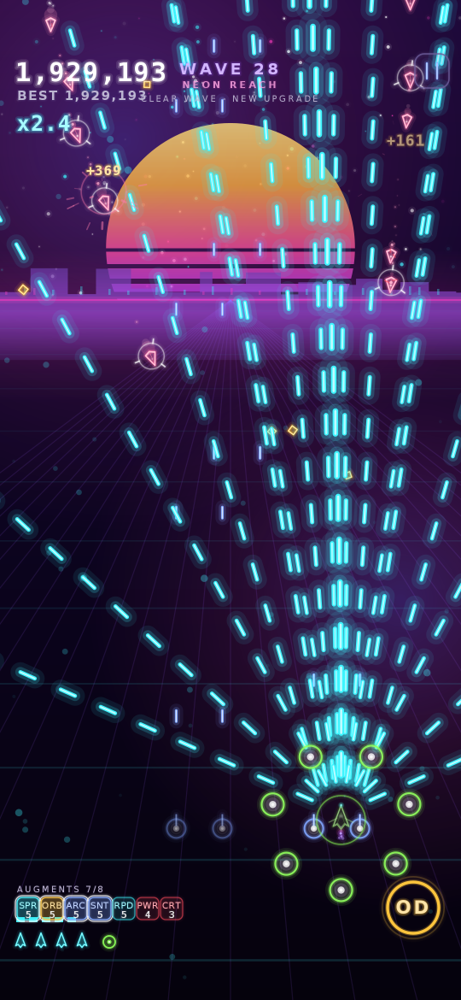</p>

| Ability | Branch A capstone | Branch B capstone |
| --- | --- | --- |
| SPREAD | **SATURATION** — every shot in the curtain pierces | **BREACH** — bolts run the whole rank |
| LANCE | **AFTERGLOW** — the lane keeps burning behind the beam | **MELTDOWN** — the column holds far longer |
| SWARM | **SWARM LOGIC** — a seeker that kills spawns a fresh one | **SALVO** — every launch throws a pair |
| ORBIT | **HALO** — a seventh node, striking twice as fast | **BROADSIDE** — nodes fire a spread, not a bolt |
| ARC | **SUPERCONDUCTOR** — every link forks a second bolt | **OVERVOLT** — the railgun recharges in half the time |
| PULSE | **RESONANCE** — a wider second ring follows each blast | **BULWARK FIELD** — the field sends the fire home |
| FLAK | **DOUBLE FUSE** — the shrapnel bursts a second time | **CARPET** — two shells, both bursting wider |
| TETHER | **SPLIT BEAM** — cuts two targets at once | **UNDERTOW** — hauls far harder, and cuts while it hauls |
| WING | **SQUADRON** — a fourth wingman | **BARRAGE** — each wing fires a pair of missiles |
| VORTEX | **EVENT HORIZON** — it collapses into a second, tighter pull | **COLLAPSE** — the detonation leaves burning ground |
| SENTINEL | **EMPLACEMENT** — turrets dig in for twice as long | **BOMBARDMENT** — every shell lands with a blast |
| CHRONO | **DILATION** — enemies crawl, and break far easier | **RECOIL** — everything returned comes back doubled |
| RICOCHET | **FISSION** — the orb splits in two on its first kill | **CRATER** — every blast leaves burning ground |
| FRACTURE | **CHAIN BREAK** — shards shatter once more | **SPLINTER** — seeking shards splinter again |
| HARVEST | **BLIGHT** — pools set what wades through them alight | **GREEN ROT** — pools creep outward as they feed |
| MIRROR | **PARADOX** — the ghost fires twice as often | **DOPPELGANGER** — a second ghost, both guarding you |
| QUAKE | **EPICENTRE** — each wall throws one back down the screen | **AFTERSHOCK WALL** — the wall grinds twice as wide |

A finished build is meant to feel finished: against a fixed maxed loadout the
capstones are worth roughly a third to a half of a path's output, and several
change how the system is flown rather than only how hard it hits.

**Stat modules** are the other half of the offer, repeatable and stackable:
RAPID (fire rate), POWER (damage), VELOCITY (projectile speed), AGILITY
(handling), MAGNET (pickup radius), GRAZE (overdrive charge), ARMOR (shield
capacity), SALVAGE (score), REPAIR (hull), COOLANT (ability cooldowns), PIERCE
(shots punch through one more enemy), CRIT (chance to hit twice) and RECLAIM
(pickups top up overdrive), HARDPOINT (raises the main gun's ceiling), EVASION
(a longer mercy window) and BOUNTY (more, richer gems). Four more reward a
particular way of flying or fighting: **FOCUS** (damage that climbs the stiller
you hold), **CASCADE** (each kill winds the trigger tighter, and it stacks),
**BULWARK** (a shield soaks more than one hit before it breaks) and
**AFTERSHOCK** (a kill can detonate, taking its neighbours with it).

Five of the modules are conditional rather than flat, and they reward how you
fly: **MOMENTUM** (damage that scales with how hard you are moving),
**VENGEANCE** (taking a hit leaves you furious — more damage and fire rate for
five seconds), **OVERCLOCK** (longer overdrive, and it charges faster),
**AFTERBURN** (main gun hits set the target alight) and **RECOVERY** (a spent
shield grows back on its own).

Forty-two augments in total, seventeen of them abilities, for eight bay slots.

Your current kit shows as badges above the lives counter, and in full on the
pause screen.

### Hangar

Runs pay out **cores** — from score and from waves cleared. Spend them in the
hangar to summon new hulls. There are eleven, across four rarities, and each
one changes how a run plays: its own silhouette, its own stat profile, and most
of them a **signature augment** installed free at launch.

| | Hulls |
| --- | --- |
| **Common** | VECTOR (baseline), PIKE (heavy rounds, heavy stick), KITE (light and nimble), SPUR (racing frame) |
| **Rare** | BULWARK (four hull segments, a shield, slow guns), VOLT (SPREAD pre-fitted), LANTERN (double magnet, +15% score), EMBER (FLAK pre-fitted), GLASS (one hull segment, enormous guns) |
| **Epic** | SABRE (LANCE pre-fitted), HALO (ORBIT pre-fitted, starts shielded), WRAITH (tiny hitbox, +70% graze), VESPER (TETHER pre-fitted), TITAN (five hull segments, very slow trigger) |
| **Legendary** | NOVA-9 (PULSE Lv2, +25% score), ARCLIGHT (ARC Lv2, +2 damage), ORACLE (WING Lv2, +20% score), PHANTOM (3.4-unit hitbox, double graze) |

Twenty-four hulls in all. **Summon x10** costs ten pulls' worth of cores and
guarantees at least one rare or better; duplicates refund as usual.

### Co-op over Wi-Fi

Two phones on the same network fly one run together. One hosts, the other joins
by typing the host's address, which the hosting screen shows.

The host is authoritative: it runs the whole simulation, so the two screens can
never disagree about where a bullet is. The client sends input and renders the
snapshots it gets back at 30 Hz, while **predicting its own ship locally** so the
thumb still feels instant — it replays un-acknowledged input on top of the host's
authoritative movement target, using the handling value the host sends, which
keeps the predicted position within a couple of units of the truth.

Both pilots keep their own hull, hull segments, shields and **separate augment
loadouts**; score, combo and waves are shared. Clearing a wave opens a draft: the
host picks first, then the partner, each from their own offer, with a "partner is
choosing" overlay in between. A downed pilot respawns while the other is still
flying — the run only ends when both are out. If the partner drops, the host
carries on solo.

Co-op needs `INTERNET` and `ACCESS_NETWORK_STATE`, used only for a socket between
the two phones. The game makes no other network calls.

### Menu

The menu is a five-tab shell with a bottom bar, the way a phone game should be.
A strip along the top always shows pilot rank, progress towards the next one and
the core balance; the tab bar along the bottom never moves, with **BATTLE**
raised in the middle.

| Tab | What lives there |
| --- | --- |
| **SHOP** | Nineteen permanent upgrades, the later half gated behind pilot rank |
| **HANGAR** | The hull roster, the summon buttons and the live pull odds |
| **BATTLE** | The hull and sector you will launch in, the PLAY button, co-op, and the three open contracts |
| **SECTORS** | The fourteen sectors, locked ones showing what they want. Scrolls |
| **PILOT** | Rank, the record sheet, the sector checklist and the sound settings |

### Contracts

Three rolling objectives sit on the BATTLE tab: destroy N enemies, reach a wave,
graze N shots, bring down N bosses, clear a sector, and so on. They fill in as
you fly and pay cores and experience when claimed, at which point a fresh
contract rolls into the slot. Targets and payouts scale with your rank, so they
stay worth doing.

### Pilot rank

Every run banks experience from its score, waves, kills and sectors cleared.
Ranking up pays cores and opens the later shop items — TARGETING RIG at rank 2,
COOLANT LINE at 4, GRAZE FIELD at 5, FORTUNE CIRCUIT at 6, WIDE DRAFT at 8 and
EMERGENCY CORE at 10 — so the workshop keeps growing rather than being one long
list from the first launch.

### Shop

The other place cores go: nineteen permanent upgrades that carry into every
run. The list opens up with pilot rank rather than arriving all at once, and it
scrolls — drag anywhere on it, including from a card.

| | Effect |
| --- | --- |
| **HULL PLATING** | An extra hull segment at launch |
| **PRIMED GUNS** | Launch with the main cannon part-upgraded |
| **BAY EXPANSION** | A ninth and tenth augment slot |
| **SHIELD GENERATOR** | Start each run with a shield up |
| **CORE MAGNETISM** | +15% cores per level from every run |
| **OVERDRIVE PRIMER** | Begin with the meter part charged |
| **SALVAGE CONTRACT** | +10% score per level |
| **TARGETING RIG** | +6% damage per level, from every source |
| **COOLANT LINE** | -7% cooldown per level on every ability system |
| **SCAVENGER** | +22% chance of a pickup per level |
| **GRAZE FIELD** | +30% graze radius per level |
| **FORTUNE CIRCUIT** | Leans the summon weights towards the rarer hulls |
| **RESERVE TANK** | +0.8s of overdrive per level, every time you fire it |
| **SALVAGE PODS** | +30% score per level from every gem you collect |
| **REINFORCED CANOPY** | +0.35s of mercy per level after a hit lands |
| **CORE BROKER** | +25% cores per level from every contract you claim |
| **ESCORT CONTRACT** | Launch with a wingman already flying |
| **WIDE DRAFT** | Every upgrade offers a fourth card |
| **EMERGENCY CORE** | Once a run, come back instead of going down |

Most of them smooth the opening and the economy; the last three are
run-changing and priced as long-term goals.

### Records

The PILOT tab tracks best score, furthest wave, sectors cleared, best combo,
runs flown, total kills, contracts completed, cores earned, hulls owned and
summons, plus a checklist of which of the fourteen sectors you have reached.

Duplicates refund cores, scaled by rarity.

### Sound

Music and effects are generated at runtime by a small software synth — a step
sequencer driving square, saw, triangle and noise voices through an envelope,
a sweeping one-pole filter and a soft clipper. Fifteen tracks (menu plus one
per level), each built from four alternating bars with an arpeggio layer, a
detuned lead, octave-jumping bass and a drum fill closing every fourth bar.
Boss waves switch the arrangement to a busier mix. No audio files ship with
the game. Music, effects and haptics each toggle from the PILOT tab.

### Enemies

| | Behaviour |
| --- | --- |
| **Drifter** | Descends steadily, fires aimed single shots |
| **Weaver** | Sine-weaves down the screen, fires aimed pairs |
| **Charger** | Drops in, locks on (red telegraph ring), then dives at you. Doesn't shoot — dodge it |
| **Turret** | Hovers and pumps out 8-way radial bursts. Tanky. Withdraws after 16 seconds |
| **Stalker** | Slides into your lane and holds it, firing straight down the column |
| **Howler** | Winds up, then throws a full ring of shells with one gap — aimed at you, so it is always reachable |
| **Seeder** | Drops pods that drift down and bloom where they stop. Shooting a pod early only decides where |
| **Mender** | No gun of its own. Beams the most damaged thing near it back to health — kill it first |
| **Guardian** | Boss, every 5th wave. Three phases — aimed fans, then radial rings, then a relentless spiral with heavy shells |

Weapons upgrade to level 5 via `W` pickups; `S` grants a shield that absorbs one
hit, `+` is an extra life. Weapon drops thin out as the gun grows, so the last
levels are earned rather than handed over, and shields stop dropping once you are
at capacity. A pity timer still guarantees a weapon eventually — sooner at low
levels, much later at high ones — so a cold streak never strands you.

## Building

Requires JDK 17+ and the Android SDK (compileSdk 35).

```bash
./gradlew assembleDebug          # APK at app/build/outputs/apk/debug/
./gradlew installDebug           # to a connected device or emulator
```

Or open the project folder in Android Studio and press Run.

minSdk is 24 (Android 7.0). The app requests only `VIBRATE`, has no network code,
no analytics and no third-party libraries.

## Code layout

```
app/src/main/java/com/neonvoid/game/
  MainActivity.kt   Fullscreen host activity
  GameView.kt       SurfaceView + render thread, touch capture, insets
  Game.kt           State machine (menu/playing/paused/over), input routing,
                    virtual 540-unit coordinate system
  World.kt          Simulation: player, bullets, enemies, pickups, wave
                    director, boss patterns, scoring
  Augments.kt       Augment catalogue, evolution branches, offer generation
                    and every stat the loadout derives
  Levels.kt         The fourteen level themes: palettes, rosters, boss pools, music
  Decor.kt          Per-sector terrain: silhouettes, parallax motes, furniture
  Waves.kt          Wave archetypes, formations and the mob budget
  Progress.kt       Pilot rank, the run tally and the rolling contracts
  Shop.kt           Permanent core-bought upgrades and the bonuses they grant
  PlayerSlot.kt     One pilot: ship, loadout, ability systems
  Protocol.kt       Co-op wire format: handshake, input, snapshots, draft
  NetLink.kt        Length-prefixed message stream over a socket
  Coop.kt           Host and client roles, prediction and reconciliation
  EnemyAI.kt        Per-kind enemy behaviour
  Bosses.kt         The five boss archetypes and their phases
  Ships.kt          Hull roster, rarities, gacha rolls, hull silhouettes
  Synth.kt          Procedural music and sound effects (no Android deps)
  Audio.kt          AudioTrack pump feeding the synth
  Arsenal.kt        Ability systems: beams, homing swarms, orbital nodes,
                    chain lightning and shockwave novas
  Entities.kt       Entity structs, ship silhouettes, entity rendering
  Background.kt     Synthwave backdrop: banded sun, perspective grid,
                    parallax stars, drifting nebulae
  Hud.kt            In-run HUD, title/pause/game-over screens
  Fx.kt             Particles, shockwaves, floating text, screen shake,
                    hit-stop, full-screen flashes
  Neon.kt           Palette, math helpers, stacked-stroke neon drawing
  Prefs.kt          Local best score / wave / combo
  Haptics.kt        Vibration wrapper
```

Everything is drawn procedurally — the only bundled assets are the launcher icons.
Gameplay is authored in a 540-unit-wide virtual space and scaled to the device, so
layout and difficulty are identical on every screen size.

### Tuning

Most of the feel lives in a handful of constants:

- `World.GRAZE_R`, `OD_DURATION`, `COMBO_WINDOW` — the risk/reward loop
- `Aug.MAX_SLOTS`, `MAX_ABILITIES`, `BASE_MAX`, `EVOLVED_MAX` — how specialised
  a run gets and how hard the choices bite
- `Levels.list` / `WAVES_PER_LEVEL` — level themes and chapter length
- `Waves.weights` / `baseCount` / `mobCeiling` — wave archetypes and density
- `World.overloadSpeed` / `overloadRate` / `overloadBullet` — the killscreen cliff
- `Shop.items` — permanent upgrade costs, caps and rank gates
- `Rank.toNext` / `Rank.xpFor` / `Missions.reward` — how fast the meta moves
- `ShipDex.list` / `Rarity.weights` — hull stats and pull rates
- `Loadout` derived getters — what each stat module is worth
- `World.dropLoot` — pickup rates and the weapon pity curve
- `World.buildWave` / `spawnEnemy` — health, fire rate and group-count ramps
- `Arsenal.tick*` — cadence and damage for every ability and branch
- `World.spawnEnemy` — per-enemy HP, speed and fire rates, plus the per-wave scaling
- `World.buildWave` — wave composition and group pacing
- `World.dropLoot` — drop tables and the weapon pity timer
- `Fx` — particle counts, shake trauma, hit-stop durations

## Verification

`dl.google.com` and Google's Maven host are blocked by the network policy of the
environment this was written in, so the APK is built by GitHub Actions rather than
locally, and the game has **not** been run on a physical device. The code was
validated headlessly here:

- Type-checked against hand-written Android API stubs (`compileKotlin`, clean).
- Played out headlessly: an 8-minute automated run reaching wave 20 confirms wave
  progression, boss spawns and phases, scoring, weapon ramp, augment offers and
  that no wave can stall; runs without invulnerability confirm the damage and
  game-over paths.
- Co-op run end to end over a real loopback socket: a host and a client
  handshake, play 150 simulated seconds, and the client's mirror matches the host
  exactly on score and wave while receiving ~3,300 snapshots. The augment draft
  crosses the wire, and pulling the partner's plug leaves the host flying solo
  rather than crashing. Local-ship prediction lands within 1.8 units of the host
  on average.
- Every parallel table cross-checked: the augment arrays all carry `Aug.COUNT`
  entries with a branch pair per ability and no blank card copy, every sector has
  an unlock rule, a four-stop sun, a real roster and a distinct terrain, hull and
  shop ids match their array index, and there is a music track per sector. This
  is the class of bug where adding one augment and forgetting one array is an
  index crash on someone's phone rather than a compile error here.
- Waves proven unable to stall: a pilot that never fires a shot and cannot die
  is flown through four waves of all fourteen sectors, and every wave has to drain on
  its own. This caught orbiters (which rebuild their position from a stored
  centre each frame) and wisps (whose blink clamps them back to the top of the
  screen) holding the field forever, either of which soft-locks a run with no
  way out but dying.
- The wave director checked over 480 non-boss waves: every archetype and every
  formation gets used, no archetype ever repeats back to back, and the mob count
  per wave stays on the curve the old fixed rotation produced.
- The killscreen measured rather than asserted: a dodging pilot is flown to a
  target wave under invulnerability, the shield comes off, and progress is
  counted inside a single difficulty band. Crossing the first overload takes a
  run from roughly three waves per pool of hull segments to one or two, with
  live enemy fire going from ~300 to ~510 units/second.
- Deep-wave pacing measured against a *fixed* maxed loadout rather than a random
  draft, since a drafted run's wave times say as much about the draft as about
  the balance. It reports seconds to clear and how full the screen was, at both
  ordinary and boss waves — which is how the late-game dead air was found, and
  how the fix was confirmed.
- Every ability path forced and played: all 51 combinations (seventeen
  abilities, base plus both evolutions) run 150 simulated seconds each without a
  crash. The suite is also the balance yardstick, compared on the median score.
  A single pass is far too noisy to tune against — one path swung between 100k
  and 245k across six runs of the *same* build — so tuning is done on medians of
  20–30 passes per path, which is what the current spread of −43% to +47%
  around the median was measured with. The band is wider than it was before
  the capstones, which is the point: a finished evolution is meant to be worth
  finishing. Note the scripted pilot is invulnerable and weaves along the bottom
  of the screen, so it systematically undervalues defensive and proximity
  systems (AEGIS, STASIS, REPULSOR, CHRONO, ORBIT): those read low here and were
  left deliberately above where the metric alone would put them. DILATION is the
  clearest case — slowing what you are farming costs a metric that only counts
  score per second, while being plainly good to actually fly behind.
- The soundtrack rendered offline to WAV and checked for level, clipping and
  rhythmic structure — the synth is deliberately free of Android imports so the
  audio that ships is the audio that was inspected.
- Driven through every UI transition with synthetic touches, including all 25
  tab-bar transitions, every shop card (buying the open ones and confirming the
  rank-locked ones refuse), every sector card (unlocked select, locked refuse),
  claiming a contract, the sound toggles, and then hangar → summon → reveal →
  hull select → play → augment choice → pause → resume → app-pause → back →
  death → retry.
- The wave director planned for every sector, forty times over, checking that
  each sector actually fields every kind on its roster, that no wave overshoots
  its mob ceiling, and that no kind escapes the roster it belongs to.
- The sector map checked for holes: because the gates sit on different axes
  (waves, score, kills, hulls), a later one can be met first, so the ladder is
  asserted to stay shut from the first unmet gate onwards.
- Rendered to PNG by backing the Canvas stubs with Java2D, which produced the
  screenshots above.

Expect to tune numbers once it's in your hands on a real device — that's where the
last 10% of feel gets decided.
